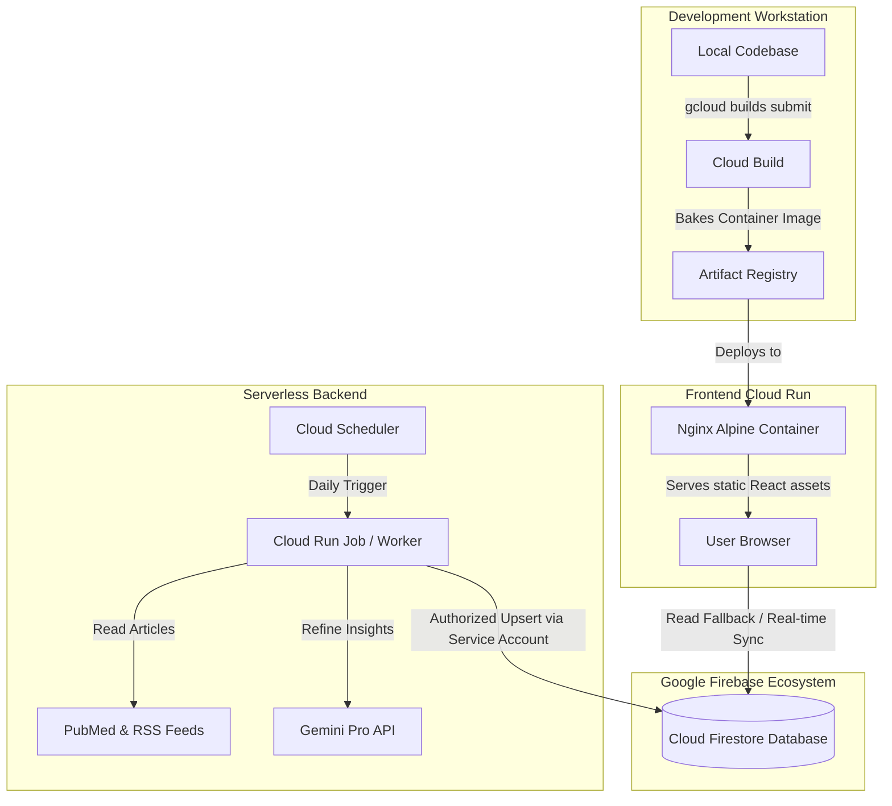

# 🦅 Avian Influenza Surveillance Portal & Autonomous AI Scanner

An interactive, high-performance web platform designed to map **Highly Pathogenic Avian Influenza (HPAI)** surveillance data, visualize researcher network connections, and dynamically ingest scientific publications using an autonomous, LLM-powered extraction pipeline.

---

## 📖 Scientific Context & Inspiration

This platform is inspired by and directly aligns with the findings of the landmark Canadian research article:
**["Mapping of stakeholders in avian influenza surveillance in Canada"](https://pmc.ncbi.nlm.nih.gov/articles/PMC11956242/)** (published in *One Health Outlook*, 2025) by *Erica Johncox, E Jane Parmley, Shayan Sharif, and Lauren E Grant*.

### 🔬 Research Synopsis & Key Takeaways:
- **The Threat:** Highly Pathogenic Avian Influenza (HPAI) H5N1 represents an unprecedented threat to animal husbandry and zoonotic public health, having forced the culling of over 11 million domestic birds in Canada and 100+ million in the US since 2022, as well as increasingly jumping to mammalian hosts.
- **Fragmentation Challenge:** Canada operates separate surveillance pipelines for domestic poultry (CanNAISS) and wild birds (CWHC, ECCC, CFIA, PHAC). This separation makes monitoring the total burden of disease complex due to non-harmonized data formats and fragmented distribution channels.
- **The Network Map:** The study systematically identified and mapped **234 key stakeholders** involved in Canada's HPAI surveillance ecosystem (7 international, 60 national, 167 provincial/territorial).
- **The Surveillance Cycle:** The authors analyzed stakeholders by their role in the public health surveillance cycle (set objectives, data collection, data consolidation, data analysis, data integration, action and dissemination, feedback, and evaluation). While **action and dissemination** was the most common role (60.3%), only 28.2% of stakeholders participated across all steps of the cycle.
- **One Health Solution:** The authors urge a shift toward **near real-time integrated surveillance systems** and interactive **Decision Support Systems (DSS)** that bridge the wild-domestic poultry data divide, enabling stakeholders to make rapid, coordinated, and localized decisions.

*This interactive surveillance portal and autonomous scanner serves as an open-source, reference implementation of this One Health vision—automatically consolidating literature findings, mapping co-authorship networks, and making surveillance insights accessible for cross-sectoral action.*

---

## 🗺️ System Overview & Architecture

The application is split into two modular components designed to scale serverless and run at near-zero base cost:

1. **Frontend Portal (Vite + React + TypeScript + Nginx):**
   A fast, premium dashboard utilizing geospatial mapping and interactive network graphs to trace papers, researcher relationships, and regional case insights. If live Firestore credentials are not configured, the frontend gracefully falls back to a comprehensive static mock database.
2. **Autonomous Scanner (Node.js + Google Gemini AI + Firebase Admin):**
   An automated parser that crawls PubMed scientific articles and RSS feeds. It leverages the **Gemini API** to perform semantic extraction, identifying researchers, institutions, research categories, and mapping coordinates, and then uploads these records to **Cloud Firestore**.

### Technical Architecture & Data Flow



---

## 🚀 Post-Clone / Fork Quickstart

To run the application locally or set up your own live production environment, follow these steps.

### 1. Prerequisites
- **Node.js** (v20.x or higher)
- **npm** (v10.x or higher)
- A **Google Cloud Platform (GCP)** or **Firebase** account (optional, for live database syncing)

### 2. Frontend Local Setup
Install dependencies and spin up the hot-reloading development server:
```bash
# Install root package dependencies
npm install

# Run Vite local development server
npm run dev
```
By default, the frontend runs in **fallback mode** using local static mock data (at `src/data/`) if no environment variables are set. To connect it to your live Firestore database, create a `.env` file in the root directory:
```env
VITE_FIREBASE_API_KEY="your-api-key"
VITE_FIREBASE_AUTH_DOMAIN="your-auth-domain"
VITE_FIREBASE_PROJECT_ID="your-gcp-project-id"
VITE_FIREBASE_STORAGE_BUCKET="your-storage-bucket"
VITE_FIREBASE_MESSAGING_SENDER_ID="your-sender-id"
VITE_FIREBASE_APP_ID="your-app-id"
```

### 3. Backend Scanner Local Setup
The scanner is housed in the `/scanner` directory. Navigate to it, install dependencies, and configure your credentials:
```bash
# Navigate to scanner directory
cd scanner

# Install dependencies
npm install
```

#### Configuring Scanner Credentials & Keys:
Create a `.env` file inside `/scanner` or set these in your local terminal:
```env
GEMINI_API_KEY="your-gemini-pro-api-key"
VITE_FIREBASE_PROJECT_ID="your-gcp-project-id"
```
To authenticate the scanner with Firestore locally, generate a Firebase Admin Service Account Key JSON:
1. Go to **Firebase Console** -> **Project Settings** -> **Service Accounts**.
2. Click **Generate New Private Key**.
3. Save the downloaded JSON file as `scanner/service_account.json`. (This file is pre-configured in `.gitignore` and will never be committed to Git).

#### Running the Scanner:
```bash
# Run a one-time database seed with baseline articles
npm run seed

# Run the live PubMed & RSS crawler
npm run start
```

---

## 🛠️ Production Deployment Guide (GCP Serverless)

The repository includes standard container configurations in the `deploy/` directory to facilitate rapid, production-grade container builds.

> [!NOTE]
> Highly sensitive environment variables, service keys, and personal deployment automation scripts (`deploy-gcp.ps1`, `deploy-gcp.sh`, and `.gcloudignore`) are excluded from Git repository tracking for security. You can configure these scripts locally to coordinate deployment.

### 1. Artifact Registry
Create a Docker registry in your chosen GCP region to store your frontend image:
```bash
gcloud artifacts repositories create surveillance-repo \
    --repository-format=docker \
    --location=northamerica-northeast1 \
    --description="Docker repository for Avian Influenza Portal"
```

### 2. Frontend Cloud Run Deployment
Submit a build using the generic container configuration and deploy it serverless. Cloud Run scales the frontend container to zero when idle, resulting in **$0.00 base cost**:
```bash
# Submit build to Cloud Build using the Dockerfile in deploy/
gcloud builds submit --tag northamerica-northeast1-docker.pkg.dev/[PROJECT-ID]/surveillance-repo/portal-frontend:latest -f deploy/Dockerfile .

# Deploy the static Nginx-served portal to Cloud Run
gcloud run deploy surveillance-app \
    --image=northamerica-northeast1-docker.pkg.dev/[PROJECT-ID]/surveillance-repo/portal-frontend:latest \
    --platform=managed \
    --region=northamerica-northeast1 \
    --allow-unauthenticated \
    --port=8080 \
    --cpu=1 \
    --memory=512Mi \
    --max-instances=5 \
    --min-instances=0
```

### 3. Serverless Daily Scanner (Cloud Run Jobs + Cloud Scheduler)
Run the scanner on demand or on a cron schedule without keeping a virtual machine active 24/7.
```bash
# Build the scanner container
gcloud builds submit --tag northamerica-northeast1-docker.pkg.dev/[PROJECT-ID]/surveillance-repo/hpai-scanner:latest ./scanner

# Create a Cloud Run Job
gcloud run jobs create hpai-daily-scanner \
    --image=northamerica-northeast1-docker.pkg.dev/[PROJECT-ID]/surveillance-repo/hpai-scanner:latest \
    --region=northamerica-northeast1 \
    --tasks=1 \
    --max-retries=1

# Trigger daily at midnight Eastern Time using Cloud Scheduler
gcloud scheduler jobs create http trigger-daily-scanner-cron \
    --schedule="0 0 * * *" \
    --location=northamerica-northeast1 \
    --uri="https://northamerica-northeast1-run.googleapis.com/v1/projects/[PROJECT-ID]/locations/northamerica-northeast1/jobs/hpai-daily-scanner:run" \
    --http-method=POST \
    --oauth-service-account-email="scanner-invoker@[PROJECT-ID].iam.gserviceaccount.com"
```

---

## 🌐 Multi-Cloud & Free-Tier Developer Alternatives

If you prefer to deploy this portal outside of Google Cloud Platform, you can easily replicate the stack using these developer-friendly alternative services:

| Feature / Resource | Google Cloud Platform (GCP) | AWS / Azure Equivalent | "Developer-Friendly" Serverless Alternatives | Self-Hosted / Open-Source Stack |
| :--- | :--- | :--- | :--- | :--- |
| **Frontend Static Hosting** | Cloud Run (w/ Nginx container) | AWS Amplify / S3 + CloudFront / Azure Static Web Apps | **Vercel** / **Netlify** / **GitHub Pages** (Extremely fast, global CDNs, zero-config Vite deployments) | **Coolify** / **Dokku** / **Nginx** on cheap VPS (DigitalOcean, Hetzner) |
| **Serverless Database** | Cloud Firestore | AWS DynamoDB / Azure CosmosDB | **Supabase** / **Pocketbase** / **MongoDB Atlas** (Excellent real-time websocket and client sync APIs) | **PostgreSQL** (with PostgREST or Supabase self-hosted) / **SQLite** |
| **Batch Job Execution** | Cloud Run Jobs | AWS ECS RunTask / AWS Lambda / Azure Container Apps | **Render Background Workers** / **Railway Tasks** | **GitHub Actions** (running scanner on free scheduling workflows) / **Cron daemon** |
| **Scheduled Trigger** | Cloud Scheduler | AWS EventBridge / Azure Scheduler | **GitHub Actions Cron Trigger** / **EasyCron** | Standard **Linux crontab** |
| **AI Extraction API** | Gemini Pro API | AWS Bedrock (Claude) / Azure OpenAI (GPT-4o) | **Anthropic API** (Claude) / **OpenAI API** (GPT-4o) | **Ollama** running a local **Llama 3** (Zero API cost, self-hosted option) |

### 🛠️ Free-Tier Configuration Example
To host this platform entirely free of charge:
1. **Frontend:** Connect the repo to **Vercel** or **Netlify**. They automatically compile Vite static assets and host them globally on a free CDN.
2. **Database:** Migrate the client connection to **Supabase** or **MongoDB Atlas** (both offer extensive free tiers).
3. **Daily Scanner:** Create a free **GitHub Actions** workflow scheduled via a cron trigger that runs the scanner inside a runner container, securely passing secret keys via GitHub repository secrets:
   ```yaml
   name: Daily HPAI Scanner
   on:
     schedule:
       - cron: '0 0 * * *' # Midnight daily
   jobs:
     scan:
       runs-on: ubuntu-latest
       steps:
         - uses: actions/checkout@v4
         - uses: actions/setup-node@v4
           with:
             node-version: 20
         - run: cd scanner && npm install
         - run: node scanner/index.js
           env:
             GEMINI_API_KEY: ${{ secrets.GEMINI_API_KEY }}
             FIREBASE_SERVICE_ACCOUNT: ${{ secrets.FIREBASE_SERVICE_ACCOUNT }}
   ```

---

## 🔒 Security & Code Integrity

- **Credentials Guard:** `.gitignore` blocks tracking of custom `.env` configurations, `scanner/service_account.json`, `firebase_config.json`, and developer-specific scripts containing GCP project IDs.
- **Oxlint Integration:** High-speed, type-safe code audits are handled via **Oxlint**. Run audits with `npm run lint`.
